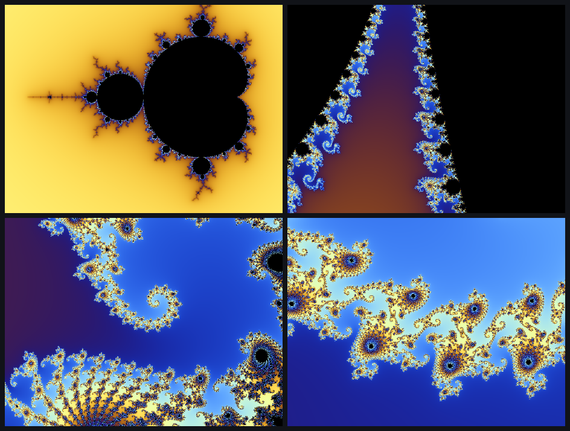

# Tensor Trainer

**Write a CUDA kernel in the browser. Watch the frames it produces stream back, live, from a real GPU.**

LeetCode-style practice for GPU programming — except the output isn't a green checkmark, it's the picture your kernel just drew.

<p align="center">
  
</p>

<p align="center">
  <em>Four frames from one run. A CUDA kernel renders each one — a thread per pixel — and every frame is<br>
  pushed to the browser as it is produced. Change <code>MAX_ITER</code>, hit Run, and the picture changes.</em>
</p>

> **Demo video:** _coming soon_ — the 20-second version is: open the playground, press Run, the fractal starts diving, edit one `#define`, press Run again, watch it change.

---

## What it does

You get a code editor, a real interactive shell, and a render surface — all backed by a Docker container that has your GPU in it.

- **Problems** with instructions, a reference solution, and tests that run your code in the container and check its stdout.
- **A Render tab.** Your program calls one function; frames appear in the browser. Still images and animation use the same path.
- **A real terminal.** Not a log pane — a PTY. `nvidia-smi`, `nano`, `nvcc` by hand, whatever you want.
- **Editor intelligence.** `clangd` runs *inside* the container, so completions and diagnostics come from the same toolchain that compiles your code.
- **A playground** that opens on a working animated fractal, so there is never a blank page.

---

## The parts worth looking at

### Getting pixels out of a container and into a browser

This is the piece the whole project is built around. A CUDA kernel writes RGBA bytes; a few milliseconds later they are a texture on a quad in the browser.

```mermaid
flowchart LR
    K["CUDA kernel<br/>one thread per pixel"] -->|cudaMemcpy| H["host buffer"]
    H -->|"tt_render_frame()"| F["/tmp/render/frame.bin<br/><i>written, then renamed</i>"]
    F -->|polled for a new seq| S["frame streamer<br/><i>node, in container</i>"]
    S -->|"stdout, length-prefixed"| D["docker exec stream"]
    D --> W["WebSocket<br/>/api/containers/:id/frames"]
    W -->|binary| T["Three.js DataTexture"]
```



Three decisions do the real work:

**Writes are atomic.** `tt_render_frame` writes a temp file and `rename()`s it into place. A reader therefore sees a whole frame or the previous one — never a half-written buffer. No locking, no handshake, and the producer never blocks on the consumer.

**Stale frames are dropped, not queued.** Each frame carries a sequence number. The streamer polls and ships a frame only when that number changes, so a kernel running at 40 fps feeding a browser that can take 15 simply skips ahead. Backpressure is impossible by construction — the alternative, a queue, would drift further behind the longer it ran.

**Frames stay binary end to end.** An 800×600 frame is 1.9 MB of RGBA. As a JSON array that's roughly 8 MB of text per frame to serialize and parse, which puts animation out of reach. The browser parses the same 16-byte header the C code writes.

### Three WebSocket protocols on one server

The terminal (PTY), the language server (LSP), and the frame stream are three different protocols over three sockets, all multiplexed onto one HTTP server by path on `upgrade`. Each attaches to a long-lived `docker exec` whose stdout is demultiplexed out of Docker's stream framing.

Sharing one server this way has a sharp edge: if the upgrade handlers ever get registered twice, two `WebSocketServer`s race to upgrade the same socket and `ws` throws. That is exactly what happened here when a port-reclaim retry called `listen()` a second time — the first callback was still registered, so both fired. Attachment is now idempotent.

### GPU passthrough

Containers are created with a `DeviceRequests` entry for `gpu`. Without it `nvcc` still compiles perfectly happily and every kernel launch then fails with *no CUDA-capable device is detected* — a confusing failure, because the compile step gives no hint anything is wrong.

Code is compiled with `-arch=sm_61` for the reference machine's Pascal card. One `problem-config.mjs` builds the command for both the grader and the terminal, so the two cannot drift apart on flags.

### A workspace image that isn't 7 GB

The obvious base image, `nvidia/cuda:12.4.0-devel`, is about 7 GB. The lab needs `nvcc` and the runtime headers — not cuBLAS, cuFFT, cuDNN, Nsight, or the static libraries. Building on `nvidia/cuda:12.4.0-base` and adding `cuda-nvcc` and `cuda-cudart-dev` gives the same capability at **1.65 GB**.

### Container lifecycle

One container per (client, workspace), reused across runs, reaped after 15 minutes idle, memory-capped, and cleaned up on server start — scoped to this project's own images, so unrelated containers on the host are left alone.

---

## Measured on the dev machine

GTX 1060 6 GB, compute capability 6.1, Docker Desktop on WSL2.

| | |
|---|---|
| Workspace image | 1.65 GB |
| `nvcc` compile, ~90-line kernel | ~1.0 s |
| Render throughput | 400 frames at 800×600 in ~10 s (~40 fps) |
| Displayed in browser | ~15 fps (the rest are dropped as stale) |
| Per frame over the wire | 1.9 MB, binary |

Double precision is the interesting cost here: deep zooms need `double`, and consumer Pascal runs FP64 at 1/32 the FP32 rate. It is a genuine stress test of a card that is bad at exactly this.

---

## Quick start

**Requirements:** Node 20+, Docker Desktop, and an NVIDIA GPU with the container toolkit (on Windows: WSL2 backend and a recent driver).

```bash
npm install
```

```bash
npm run docker:build
```

That build pulls a CUDA base image and installs the toolchain — expect several minutes and about 1.7 GB. Do it once, ahead of time.

```bash
npm run dev:server
```

```bash
npm run dev
```

Then open `http://localhost:5173`, pick **Kernel Lab**, and press **Run**.

**No database required.** Problems, projects, and help docs are read straight from `server/src/data/`. Supabase is optional and adds only accounts, saved progress, and playground file persistence — to enable it, fill in `server/.env` (see the comments in that file) and run `server/src/db/supabase-setup.sql` in your project.

---

## Writing a kernel that draws something

```cuda
#include "tt_render.h"

// ... fill rgba with width * height * 4 bytes ...
tt_render_frame(rgba, width, height);
```

That's the entire API. Call it once for a still image, or in a loop for animation — render as fast as the card allows and the panel shows the newest frame. Row 0 is the top; channels are R, G, B, A.

---

## The CUDA track

| Problem | Teaches |
|---|---|
| **Hello, GPU** | `__global__`, `cudaMalloc`, `cudaMemcpy` — the three-step round trip |
| **One Thread Per Pixel** | Index arithmetic, the ragged-edge guard, why order doesn't matter |
| **The Mandelbrot Set** | Escape-time iteration, `__host__ __device__`, warp divergence |
| **Animate the Zoom** | The render loop, smooth colouring, where the time actually goes |

Each render problem also prints something deterministic — pixel values, or set membership at four points whose answers are known analytically — so the existing stdout validator grades them without needing to compare images.

The C and C++ tracks from earlier work are still there (50 problems) and still run.

---

## Tech stack

**Client** — React 19, TypeScript, Vite, CodeMirror 6, xterm.js, Three.js
**Server** — Node, Express, `ws`, dockerode, optional Supabase/PostgreSQL
**Workspace** — Ubuntu 22.04, CUDA 12.4, clangd, Node

---

## Docs

- [`docs/add-new-languages-and-workspaces.md`](docs/add-new-languages-and-workspaces.md) — adding a language or workspace
- [`server/src/db/SCHEMA.md`](server/src/db/SCHEMA.md) — table reference
- [`server/src/data/problems/LLM_PROBLEM_AUTHORING_GUIDE.md`](server/src/data/problems/LLM_PROBLEM_AUTHORING_GUIDE.md) — problem JSON format
- In-app **Help** tab — the render pipeline and CUDA notes for this workspace

---

## Known limits

Single-node: containers are created on whatever host runs the API. Memory is capped per container but CPU and PIDs are not. `-arch=sm_61` targets Pascal — change it in `problem-config.mjs` for a different GPU generation. Sign-in, saved progress, and playground files need Supabase configured; everything else does not.
